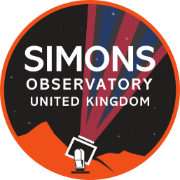

This is the SO:UK Logo, courtesy of Tom Brien (Cardiff). The minified version using [nano](https://vecta.io/nano) is given below:

You can also see the source from <https://github.com/simonsobs-uk/logo/>
