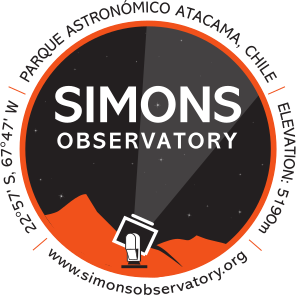
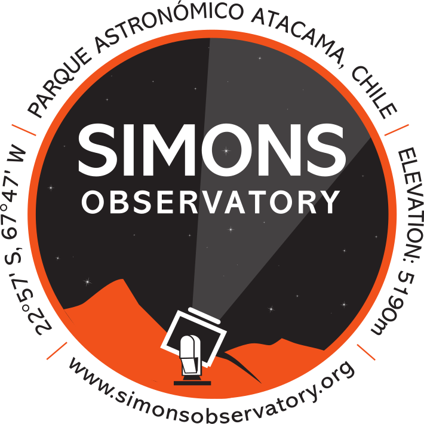
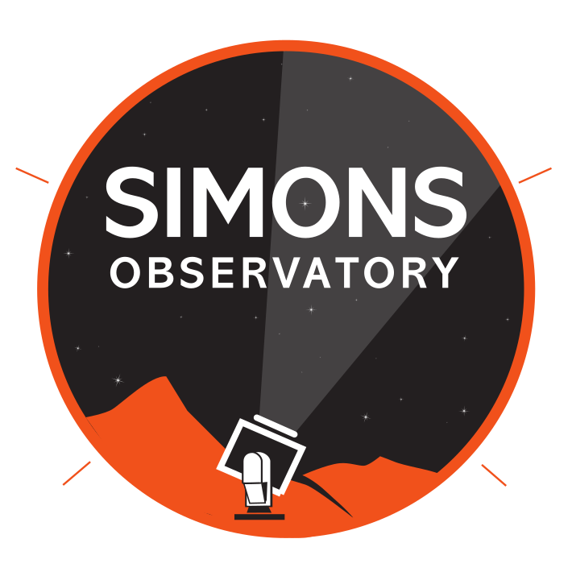
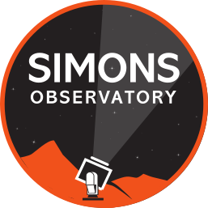

# SO:UK Logos

This is the SO:UK Logo, courtesy of Tom Brien (Cardiff). The minified version using [nano](https://vecta.io/nano) is given below:

You can also see the source from <https://github.com/simonsobs-uk/logo/>

# SO Logos

<video width="320" height="240" controls>
  <source src="SO/SO_Animated_Logo.mov" type="video/mp4">
  Your browser does not support the video tag.
</video>
